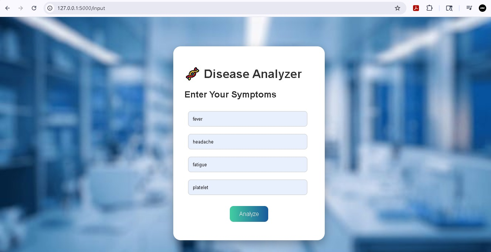
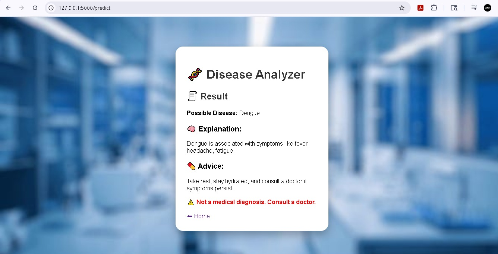

# 🧬 Disease Analyzer

A web-based application that predicts possible diseases based on user-entered symptoms using a dataset-driven approach.

---

## 🚀 Features
- Symptom-based disease prediction
- Explanation of predicted disease
- Basic health advice
- User-friendly interface
- Single-page interaction (smooth UI)

---

## 🛠 Tech Stack
- Python (Flask)
- HTML
- CSS
- Database: CSV

---

## 📂 Project Structure
disease-analyzer/
│
├── app.py
├── dataset.csv
├── templates/
│     ├── home.html
│     ├── input.html
│     └── result.html
├── static/
│     ├── style.css
│     ├── script.js
│     └── lab.jpg

---

## 📸Screenshots

### Home Page

### Input Page

### Result Page

---

## Author ©
Shaik mohammed haameed
